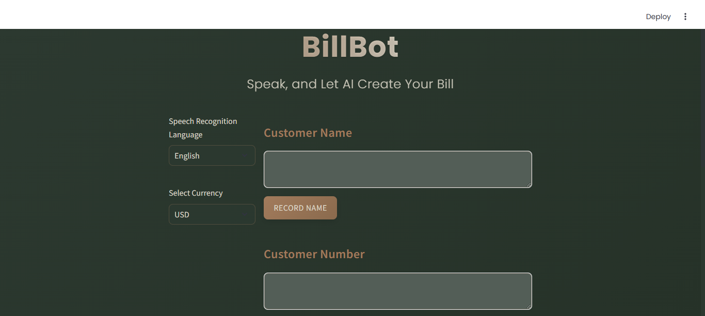
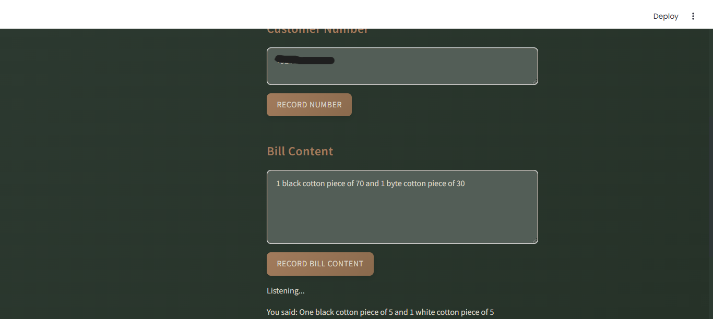
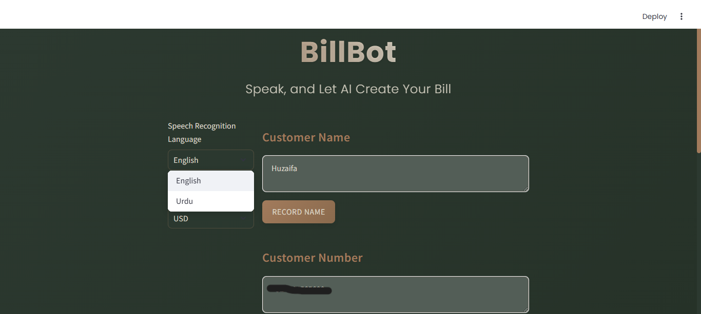
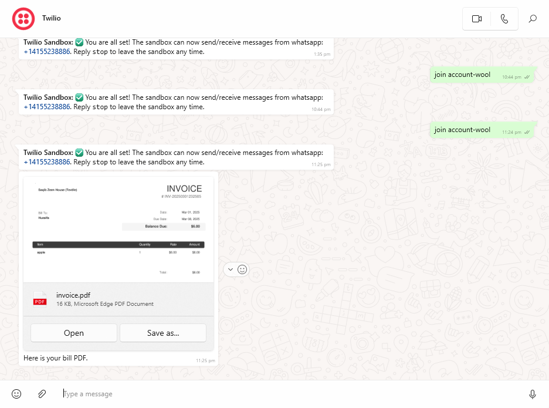
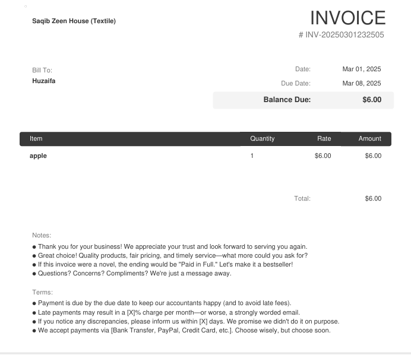

# BillBot: Speak, and Let AI Create Your Bill

BillBot is a voice-powered invoicing application that transforms spoken descriptions into professionally formatted invoices, making billing effortless for businesses of all sizes. Simply speak your customer details and items, and BillBot handles the rest.




## Problem Statement

Small retailers and market vendors face significant challenges with traditional billing processes:
- Manual invoice creation is time-consuming and error-prone
- Paper-based systems lead to document loss and disorganization
- Tracking customer information relies on memory or scattered notes
- Limited ability to send digital receipts to customers immediately

BillBot addresses these pain points by providing a voice-first, digital invoicing solution that's accessible even during busy customer interactions.

## Features

- **Voice Recognition**: Capture customer details and bill contents through voice input in multiple languages
- **Multilingual Support**: Currently supports English and Urdu
- **Currency Options**: Generate invoices in USD or PKR
- **Smart Number Processing**: Automatically converts spoken numbers (e.g., "five") to digits (5)
- **AI-Powered Item Parsing**: Uses Gemini AI to extract structured data from natural language descriptions
- **Professional Invoice Generation**: Creates PDF invoices with company branding and all required details
- **Instant Delivery**: Sends invoices directly to customers via WhatsApp
- **Modern UI**: Clean, responsive interface with a dark-themed design



## Tech Stack

- **Frontend & Application**: Streamlit
- **Speech Recognition**: Google Speech Recognition API via SpeechRecognition library
- **Item Parsing & Structuring**: Google Gemini 2.0 API
- **Invoice Generation**: Invoice Generator API
- **Messaging**: Twilio API (WhatsApp integration)
- **File Hosting**: tmpfiles.org API for temporary file hosting
- **Styling**: Custom CSS with Streamlit components

## Getting Started

### Prerequisites

- Python 3.7 or later
- A microphone for voice input
- API keys for Gemini, Invoice Generator, and Twilio
- WhatsApp Business account connected to Twilio

### Installation

1. Clone the repository:
   ```bash
   git clone https://github.com/zaiffishiekh01/billbot.git
   cd billbot
   ```

2. Install required packages:
   ```bash
   pip install -r requirements.txt
   ```

3. Create a `.env` file in the project root with your API credentials:
   ```
   TWILIO_SID=your_twilio_sid
   TWILIO_AUTH_TOKEN=your_twilio_auth_token
   TWILIO_PHONE_NUMBER=whatsapp:+number
   INVOICE_GEN_API_URL=https://invoice-generator.com
   INVOICE_GEN_API_KEY=your_invoice_generator_api_key
   GEMINI_API_KEY=your_gemini_api_key
   ```

### API Setup Guide

#### 1. Gemini API
- Visit [Google AI Studio](https://makersuite.google.com/app/apikey)
- Create an account if you don't have one
- Generate an API key
- Add it to your `.env` file as `GEMINI_API_KEY`

#### 2. Invoice Generator API
- Go to [Invoice Generator](https://invoice-generator.com/)
- Create an account and subscribe to their API service
- Locate your API key in your account dashboard
- Add the API URL and key to your `.env` file

#### 3. Twilio API (for WhatsApp)
- Sign up at [Twilio](https://www.twilio.com/)
- Navigate to the WhatsApp section and follow setup instructions
- Get your SID and Auth Token from the dashboard
- Add these credentials to your `.env` file
- Format your WhatsApp number as `whatsapp:+number` in the .env file

### Hugging Face Spaces Integration

When deploying BillBot on Hugging Face Spaces, use Hugging Face's Secret Management to securely store your API credentials:

1. Navigate to your Space settings
2. Go to the Secrets section
3. Add each environment variable from your `.env` file as a secret
4. Hugging Face Spaces will automatically make these secrets available to your application

This approach ensures your API keys remain secure and aren't exposed in your code repository.

### Running the Application

Start the Streamlit app:
```bash
streamlit run app.py
```

The application will open in your default web browser.

## Usage Guide



1. **Select Language**: Choose English or Urdu for voice recognition
2. **Select Currency**: Choose USD or PKR for the invoice
3. **Enter Customer Information**:
   - Type or click "Record Name" to capture customer name via voice
   - Type or click "Record Number" to capture customer phone number
4. **Enter Bill Content**:
   - Type or click "Record Bill Content" to describe items, quantities, and prices
   - Example: "2 cotton shirts at 15 dollars each and 1 pair of jeans at 40 dollars"
5. **Generate and Send**: Click the button to process and send the invoice
6. **Delivery**: The customer receives a professional PDF invoice via WhatsApp




## Understanding tmpfiles.org Integration

BillBot uses tmpfiles.org for temporary file hosting to deliver PDF invoices via WhatsApp. Here's what you need to know:

- **Temporary Storage**: Files uploaded to tmpfiles.org are only stored for 60 minutes
- **Privacy Considerations**: Since files are publicly accessible via the generated URL, sensitive information should be handled with care
- **How It Works**: 
  1. BillBot generates the invoice PDF locally
  2. The PDF is uploaded to tmpfiles.org to get a publicly accessible URL
  3. Twilio uses this URL to send the PDF via WhatsApp
  4. After 60 minutes, the file is automatically deleted from tmpfiles.org

> **⚠️ Privacy Warning**: Files uploaded to tmpfiles.org are publicly accessible for 60 minutes. For enhanced privacy and security in a production environment, consider implementing a more secure file storage solution with proper authentication.

## Current Limitations

- **Temporary File Storage**: Files on tmpfiles.org are only available for 60 minutes and are publicly accessible
- **Phone Number Validation**: No validation for phone number formats
- **Error Handling**: Limited error handling for API failures
- **Voice Recognition Accuracy**: May struggle with strong accents or background noise
- **Item Parsing**: Complex item descriptions might not always be structured correctly
- **Template Customization**: Limited invoice template customization options
- **Offline Operation**: Requires internet connection for all operations
- **Platform Restrictions**: When deployed on platforms with limited hardware access (like Hugging Face Spaces), voice input may not be available, but the application will fall back to text input mode.

## Future Improvements

- **Secure File Storage**: Implement a more secure file storage solution with proper authentication
- **Enhanced Voice Recognition**: Improve accuracy and add more languages
- **Inventory Integration**: Connect to inventory systems to update stock levels
- **Customer Database**: Save customer information for quick selection in future transactions
- **Receipt Templates**: Add multiple customizable templates
- **Financial Reporting**: Generate sales reports and analytics
- **Payment Integration**: Allow customers to pay directly from the invoice
- **Offline Mode**: Enable basic functionality without internet connection
- **Mobile App**: Develop dedicated mobile applications
- **Bulk Operations**: Process multiple invoices simultaneously
- **Custom Branding**: More options for business branding on invoices

## Environment Variables

For security reasons, we don't share the actual `.env` file. Here's a template with the required variables:

```
TWILIO_SID=your_twilio_sid
TWILIO_AUTH_TOKEN=your_twilio_auth_token
TWILIO_PHONE_NUMBER=whatsapp:+number
INVOICE_GEN_API_URL=https://invoice-generator.com
INVOICE_GEN_API_KEY=your_invoice_generator_api_key
GEMINI_API_KEY=your_gemini_api_key
```

## Troubleshooting

- **WhatsApp Messages Not Sending**: Ensure your Twilio WhatsApp account is properly set up and the customer's number is in the correct format (with country code)
- **Voice Recognition Issues**: Make sure your microphone is working and try speaking clearly in a quiet environment
- **PDF Generation Fails**: Check your Invoice Generator API credentials
- **Gemini API Errors**: Verify your API key and ensure you're within usage limits
- **No Microphone Available**: If you're using BillBot in an environment where microphone access is restricted (like Hugging Face Spaces), the application will automatically detect this and suggest using text input instead. This ensures the app remains functional even without voice input capabilities.

## About the Developer

This project was developed by Muhammad Huzaifa Saqib (zaiffi), a developer passionate about creating practical AI-powered solutions for everyday business problems.

- GitHub: [zaiffishiekh01](https://github.com/zaiffishiekh01)
- LinkedIn: [Muhammad Huzaifa Saqib](https://www.linkedin.com/in/muhammad-huzaifa-saqib-90a1a9324/)
- Email: zaiffishiekh@gmail.com
